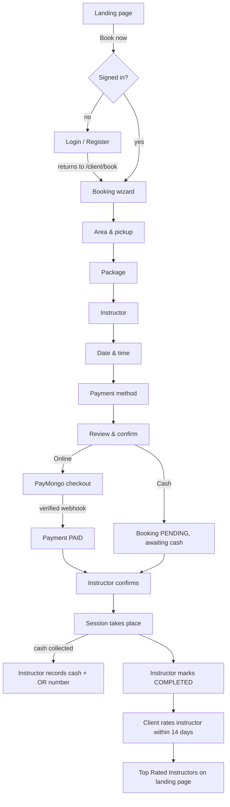
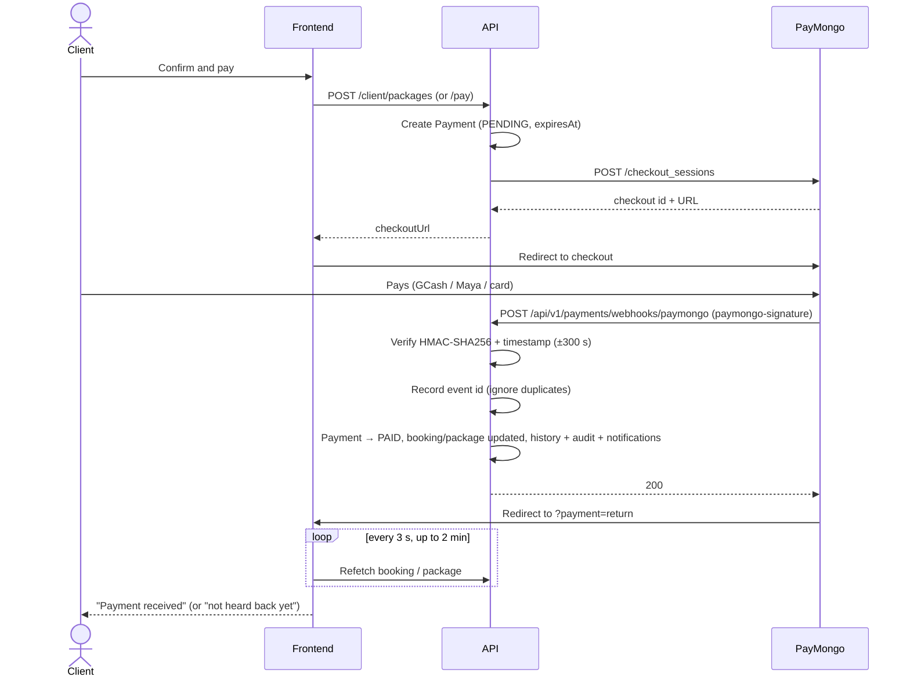
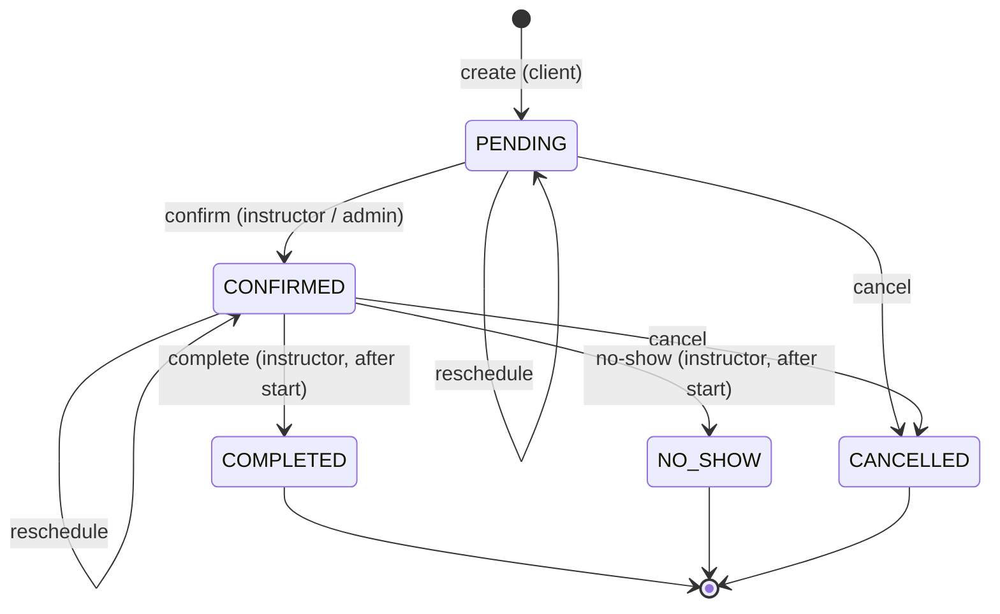

# GVN-Safestart


GVN-Safestart is a booking platform for a driving school. Clients sign up, pick a lesson package, choose an instructor (nearest-first recommendations or search), book a time slot from the instructor's availability, and pay a reservation fee online through PayMongo or in cash to the instructor. Instructors confirm, run, and complete sessions, record cash with official receipt numbers, and manage their weekly availability. Clients rate instructors after a completed session. Admins manage instructors, branches, package prices, settings, cash void requests, and the audit log.

> PostgreSQL version in the badge is indicative. TODO: confirm the version you run.

---

## Contents

1. [Tech stack](#tech-stack)
2. [Project structure](#project-structure)
3. [Getting started](#getting-started)
4. [Roles](#roles)
5. [The big picture](#the-big-picture)
6. [Client registration and login](#client-registration-and-login)
7. [Booking flow](#booking-flow)
8. [Payment](#payment)
9. [Booking lifecycle](#booking-lifecycle)
10. [Instructor](#instructor)
11. [Cash handling](#cash-handling)
12. [Notifications](#notifications)
13. [Ratings](#ratings)
14. [Admin](#admin)
15. [Security](#security)
16. [Settings](#settings)
17. [Data model](#data-model)
18. [API reference](#api-reference)

---

## Tech stack

| Layer | Technology | Purpose |
|---|---|---|
| Language | JavaScript (CommonJS on the backend, ES modules on the frontend) | Whole codebase |
| Backend runtime | Node.js + Express 4 | REST API under `/api/v1` |
| Database | PostgreSQL | Primary data store |
| ORM | Prisma 6 | Schema, migrations, queries (raw SQL for locks and overlap checks) |
| Validation | zod | Request body, query and params schemas; env config |
| Auth | jsonwebtoken, bcrypt, cookie-parser | Short-lived JWT access token, rotating refresh token in httpOnly cookie, password hashing |
| Social login | google-auth-library, Facebook Graph API | Google ID token and Facebook access token sign-in (API only) |
| SMS | console provider | OTP codes are written to the server log |
| Email | nodemailer (SMTP) or console | Booking notification emails |
| Payments | PayMongo Checkout Sessions (or a local `fake` provider) | Online reservation and balance payments (GCash, Maya, card) |
| Geocoding | OpenStreetMap Nominatim | Reverse geocoding for "Use my current location" |
| Security | helmet, cors, express-rate-limit | Headers, single-origin CORS, rate limits |
| Logging | winston | Structured request and app logs |
| Scheduling | node-cron | Runs auto-complete every 15 minutes (Asia/Manila) when `ENABLE_CRON=true` |
| Frontend | React 18 + Vite | SPA |
| Routing | React Router 7 | Pages and role guards |
| HTTP | axios | Single client with bearer token and 401 → refresh → retry |
| State | Zustand | Auth session (in memory only) |
| Forms | React Hook Form + zod | Form state and validation |
| Styling | Tailwind CSS v4 | Dark theme with gold accent |
| Animation / icons | motion, @phosphor-icons/react | Scroll reveals, icons |
| Testing | Jest + Supertest (backend), Vitest + React Testing Library (frontend) | Unit and API tests |

---

## Project structure

```
/
├── backend/
│   ├── prisma/
│   │   ├── schema.prisma     # data model
│   │   ├── migrations/       # SQL migrations (0_init … 7_yearly_receipt_counter)
│   │   └── seed.js           # dev seed: admin, branches, instructors, sample data
│   ├── db/schema.sql         # pgAdmin paste script
│   ├── scripts/              # dev helpers (simulate payment webhook, finish a session)
│   ├── src/
│   │   ├── config/           # env loading (zod-validated), logger, prisma client
│   │   ├── routes/           # route definitions (admin/ subfolder for admin)
│   │   ├── controllers/      # request → service → response
│   │   ├── services/         # business logic (bookings, payments, cash, ratings, …)
│   │   │   ├── payments/     # PayMongo + fake provider, webhook signature check
│   │   │   ├── providers/    # Google / Facebook token verifiers
│   │   │   ├── email/        # console / SMTP senders
│   │   │   └── sms/          # console SMS sender
│   │   ├── repositories/     # data access only
│   │   ├── middlewares/      # auth, roles, validation, rate limit, errors
│   │   ├── validators/       # zod request schemas
│   │   ├── jobs/             # bookingSweeper (auto-cancel unpaid / unconfirmed), autoCompleteJob (node-cron)
│   │   ├── utils/            # AppError, asyncHandler, geo, timezone, temp passwords
│   │   └── app.js            # express app
│   ├── tests/                # Jest + Supertest
│   └── server.js             # entry point; starts the sweeper
├── frontend/
│   ├── public/               # logo, favicon, images
│   ├── src/
│   │   ├── api/              # axios client + per-resource request functions
│   │   ├── components/       # shared presentational components
│   │   ├── features/         # auth, client, instructor, admin, landing, notifications
│   │   ├── hooks/            # shared hooks
│   │   ├── pages/            # route-level pages
│   │   ├── routes/           # router config, RequireAuth, RequireRole
│   │   ├── store/            # Zustand auth store
│   │   └── main.jsx
│   └── tests/                # Vitest + RTL
└── CLAUDE.md                 # contributor conventions
```

---

## Getting started

### Prerequisites

- Node.js (LTS) and npm
- PostgreSQL with two databases: one for development, one for tests (e.g. `safestart`, `safestart_test`)
- Optional: PayMongo test keys, SMTP account, a tunnel (cloudflared / ngrok) to receive webhooks locally

### Install

```bash
cd backend && npm install
cd ../frontend && npm install
```

### Environment variables

Create `backend/.env` and `frontend/.env` with the variables below (`.env*` files are git-ignored, including examples). Never commit them. The API validates its env on startup and lists anything missing or invalid.

**Backend**

| Variable | Description |
|---|---|
| `NODE_ENV` | `development`, `test` or `production` |
| `PORT` | API port (default 4000) |
| `DATABASE_URL` | PostgreSQL connection string |
| `TEST_DATABASE_URL` | Separate database used by `npm test` (required for tests) |
| `JWT_ACCESS_SECRET` | Access-token signing secret (min 16 chars) |
| `JWT_REFRESH_SECRET` | Required by config (min 16 chars). TODO: confirm — not currently used to sign anything |
| `JWT_ACCESS_TTL` / `JWT_REFRESH_TTL` | Token lifetimes (default `15m` / `7d`) |
| `CORS_ORIGIN` | The frontend origin allowed by CORS |
| `RATE_LIMIT_WINDOW_MS` | Window for all rate limiters (default 15 min) |
| `RATE_LIMIT_MAX` | Auth route requests per IP per window (default 10) |
| `PUBLIC_RATE_LIMIT_MAX` | Public catalog requests per IP per window (default 300) |
| `BCRYPT_ROUNDS` | bcrypt cost, 10–15 (default 12) |
| `LOG_LEVEL` | `error`, `warn`, `info`, `debug` |
| `GOOGLE_CLIENT_ID` | Enables Google sign-in (optional) |
| `FACEBOOK_APP_ID` / `FACEBOOK_APP_SECRET` | Enables Facebook sign-in (optional) |
| `OTP_TTL_SECONDS`, `OTP_MAX_ATTEMPTS`, `OTP_LENGTH`, `OTP_RATE_LIMIT_MAX` | Phone OTP settings |
| `SMS_PROVIDER` | `console` (only option) |
| `EMAIL_PROVIDER` | `console` or `smtp` |
| `EMAIL_FROM` | Sender address for notification emails |
| `SMTP_HOST`, `SMTP_PORT`, `SMTP_USER`, `SMTP_PASS` | SMTP settings (host required when `EMAIL_PROVIDER=smtp`) |
| `PAYMENT_PROVIDER` | `fake` (dev only, refused in production) or `paymongo` |
| `PAYMONGO_SECRET_KEY` | PayMongo secret key (required for `paymongo`) |
| `PAYMONGO_WEBHOOK_SECRET` | PayMongo webhook signing secret (required for `paymongo`) |
| `PAYMONGO_API_BASE` | PayMongo API base URL |
| `FAKE_PAYMENT_WEBHOOK_SECRET` | Signs webhooks for the fake provider (dev only, optional) |
| `APP_BASE_URL` | Frontend origin; PayMongo returns the client here |
| `API_PUBLIC_URL` | Public API address PayMongo posts webhooks to |
| `GEOCODER_PROVIDER` | `nominatim` or `off` |
| `GEOCODER_BASE_URL` | Nominatim base URL |
| `GEOCODER_CONTACT_EMAIL` | Contact email required by the Nominatim usage policy |
| `APP_TIMEZONE` | IANA zone for slots, "today", receipt years and the auto-complete schedule (default `Asia/Manila`) |
| `ENABLE_CRON` | `true` starts the 15-minute auto-complete schedule in this process (default `false`) |
| `CRON_SECRET` | Bearer secret for `POST /cron/auto-complete` (min 16 chars). Unset means the endpoint always returns 401 |
| `SEED_ADMIN_EMAIL` / `SEED_ADMIN_PASSWORD` | First admin account created by the seed |

**Frontend**

| Variable | Description |
|---|---|
| `VITE_API_BASE_URL` | API base URL (falls back to `/api/v1`, which the Vite dev server proxies to port 4000) |

### Database

```bash
cd backend
npm run prisma:migrate     # prisma migrate dev — applies prisma/migrations
npm run db:seed            # refuses to run in production
```

The seed creates the admin from `SEED_ADMIN_EMAIL` / `SEED_ADMIN_PASSWORD`, 5 branches, 3 sample instructors (`instructorN@example.test`, same password as the seed admin), 10 sample clients, and sample bookings and payments. `backend/db/schema.sql` is an alternative script for pasting into pgAdmin.

### Run

```bash
# terminal 1
cd backend && npm run dev      # http://localhost:4000/api/v1

# terminal 2
cd frontend && npm run dev     # http://localhost:5173
```

### After pulling the auto-complete feature

```bash
cd backend
npm install                 # adds node-cron
npm run prisma:migrate      # applies 8_auto_complete
```

Then add `ENABLE_CRON=true` and a `CRON_SECRET` to `backend/.env` if this instance should run the schedule or accept external triggers.

### Dev helpers

| Command | What it does |
|---|---|
| `npm run payments:simulate` | Sends a correctly signed "paid" webhook to the local API (refuses production) |
| `npm run dev:finish-session` | Moves a booking's start 2 hours into the past so it can be completed and rated (refuses production) |

### Tests and lint

```bash
cd backend && npm run lint && npm test
cd frontend && npm run lint && npm test
```

---

## Roles

| Role | How the account is created | Frontend area | API area |
|---|---|---|---|
| **CLIENT** | Public signup (`POST /auth/register`); role is always forced to CLIENT. A first Google, Facebook or phone-OTP sign-in also creates a CLIENT. | `/client/*` | `/client/*`, public catalog |
| **INSTRUCTOR** | Created by an admin (`POST /admin/instructors`) with a one-time temporary password. Must change it on first login. | `/instructor/*` | `/instructor/*` |
| **ADMIN** | First admin from `npm run db:seed`. Others created by an admin (`POST /admin/admins`) with a temporary password. | `/admin/*` | `/admin/*`, `/registrations` |

- Wrong role on a frontend page shows a 403 page. The API enforces roles independently with `requireRole`.
- An admin cannot deactivate themselves or the last active admin.
- There is no endpoint to reactivate a deactivated user.

---

## The big picture



---

## Client registration and login

**Register** (`/register`)

| Field | Rule |
|---|---|
| Full name | 2–120 characters |
| Email | Valid email, trimmed and lowercased, must be unique |
| Mobile number | Optional, E.164 format (`^\+[1-9]\d{7,14}$`), must be unique |
| Password | At least 8 characters with a lowercase letter, an uppercase letter and a digit |
| Confirm password | Must match |

The same rules are enforced by the API (`registerSchema` is strict; sending `role` is rejected). Signup writes a `users` row and a `registrations` row in one transaction.

**Login** (`/login`): email and password.

The API also supports Google, Facebook and phone-OTP sign-in, but the frontend shows only email and password. TODO: confirm whether social and OTP buttons are planned.

**Redirect after login**

- If the user was sent to login from a protected page, they return to that page (including its query string).
- Otherwise they go to their role's home: ADMIN → `/admin`, INSTRUCTOR → `/instructor`, CLIENT → `/client`.
- If `mustChangePassword` is set, they go to `/change-password` first.

**"Book Now"**

- All "Book now" buttons link to `/book`, which redirects to `/client/book`.
- Logged out: the guard sends the user to `/login`, then back to `/client/book` after login or registration.
- "Book with {name}" on a Top Rated card links to `/client/book?instructor={id}`; the instructor is preselected after login.
- Only the URL survives the login detour. Answers already entered in the wizard are not kept.

---

## Booking flow

The client wizard (`/client/book`) has six steps. The step number is kept in `?step=`.

| Step | What happens |
|---|---|
| 1. Area | Pick a service area, training type (Own Car / Car Rental), and pickup address (5–300 chars). Location comes from browser geolocation (reverse-geocoded, nearest branch computed) or a branch select. The location is saved to the client profile. |
| 2. Package | Packages priced for the chosen area and training type. Each card shows price, sessions × hours and the reservation fee. Packages with no rate are shown as unavailable. |
| 3. Instructor | **Recommended** tab: `GET /instructors/recommended` ranks by distance to the instructor's branch, then availability on the preferred date, then rating (instructors with fewer than 3 ratings rank lowest), then name; max 20, with the next open slot in the next 14 days. **Choose instructor** tab: search by name and filter by branch. Recommendation is advisory; the client can pick anyone bookable. |
| 4. Date & time | Month calendar + slots from `GET /instructors/:id/slots`. Slots step every 30 minutes inside the instructor's weekly windows, skip days off, past times, and times overlapping PENDING or CONFIRMED bookings. Only session 1 is booked here; later sessions are booked from **My packages**. |
| 5. Payment | **Online** (GCash, Maya or card via PayMongo) or **Cash** to the instructor. Shows reservation fee and balance. |
| 6. Review | Summary, then **Confirm** sends `POST /client/packages`. Online redirects to checkout. If the slot was taken meanwhile, the wizard returns to step 4. |

**How double-booking is prevented**

Inside the booking (or reschedule) transaction, the API:

1. Locks the instructor's user row (`SELECT … FOR UPDATE`), serialising all booking writes for that instructor.
2. Checks the slot fits a weekly availability window (`OUTSIDE_AVAILABILITY`) and is not a day off (`INSTRUCTOR_DAY_OFF`).
3. Runs an overlap query for PENDING or CONFIRMED bookings of the same instructor. A match returns `409 SLOT_TAKEN`.

There is no database-level exclusion constraint on booking times, and no check that the client has another booking at the same time.

---

## Payment

### Online (PayMongo)



- **Only the verified webhook marks an online payment PAID.** The return URL never changes payment state; the page only polls.
- Event types other than `checkout_session.payment.paid` are recorded and ignored.
- The webhook takes the same per-instructor lock as cash recording. If the booking (or package balance) was already settled, for example by cash, the online payment is still recorded as PAID but is not applied a second time; the booking history notes "refund needed", the audit entry has `refundNeeded: true`, and the client is told the extra payment will be refunded. Refunds themselves are manual.
- An open, unexpired checkout is reused instead of creating a new one.
- Unpaid online bookings and packages are auto-cancelled after `onlinePaymentExpiryMinutes` (see [Settings](#settings)).
- With `PAYMENT_PROVIDER=fake`, checkout sends the client straight back; use `npm run payments:simulate` to send the webhook.

### Cash

- The booking is created with `paymentStatus = AWAITING_CASH`.
- The instructor records cash on a CONFIRMED or COMPLETED booking; this marks it PAID and issues an official receipt number (see [Cash handling](#cash-handling)).
- A cash booking can still be paid online; the webhook then switches it to ONLINE.
- PENDING cash bookings not confirmed `cashAutoCancelHours` before the session are auto-cancelled.

### Packages

A package purchase stores the price and a reservation fee (`min(reservationFee setting, price)`). Payments go to the remaining reservation fee first, then the balance. Package payment status moves through UNPAID / AWAITING_CASH → RESERVED → PAID and is mirrored to each session. The next session can only be booked once the reservation fee is paid.

**What marks a booking paid:** the verified PayMongo webhook, or an instructor cash record. Nothing else.

---

## Booking lifecycle



| Action | From → To | Client | Instructor (own) | Admin | System |
|---|---|---|---|---|---|
| Create | – → PENDING | ✓ | | | |
| Confirm | PENDING → CONFIRMED | | ✓ | ✓ | |
| Reschedule | PENDING/CONFIRMED (status unchanged) | ✓ before cutoff | ✓ | ✓ | |
| Cancel | PENDING/CONFIRMED → CANCELLED | ✓ before cutoff | ✓ | ✓ | ✓ sweeper |
| Complete | CONFIRMED → COMPLETED | | ✓ after start | | |
| No-show | CONFIRMED → NO_SHOW | | ✓ after start | | |

- Cutoff: clients cannot cancel or reschedule within `clientChangeCutoffHours` of the session.
- Reschedule and cancel require a reason.
- COMPLETED, NO_SHOW and CANCELLED are final, with one exception: an instructor can turn a session **the system** completed into NO_SHOW within 24 hours (see below).
- Transitions use a conditional update; a stale action returns `INVALID_BOOKING_TRANSITION`.

**Auto-complete** (`runAutoComplete()` in `src/services/autoComplete.service.js`):

| Rule | Result |
|---|---|
| CONFIRMED and session end + `autoCompleteGraceHours` (default 2) has passed | COMPLETED by SYSTEM, `auto_completed = true`, history reason "Auto-completed after session end". Client: "How was your session? Rate your instructor." Instructor: "Session with [client] was marked completed." |
| …and it is a cash booking not yet paid | Still completed, counted as *cash unpaid*; the instructor also gets "Cash not recorded for [client]'s session." |
| PENDING and its start time has passed | CANCELLED by SYSTEM, reason "Not confirmed before session start"; client and instructor notified |
| COMPLETED, NO_SHOW, CANCELLED | Never touched |

- One transaction per run; rows are taken with `FOR UPDATE SKIP LOCKED` in batches of 200. Re-running finds nothing already handled.
- Triggers: node-cron every 15 minutes when `ENABLE_CRON=true` (guarded by `pg_try_advisory_xact_lock`, so only one instance processes and the others record SKIPPED), `POST /api/v1/cron/auto-complete` with `Authorization: Bearer $CRON_SECRET`, and the admin **Run now** button. Each writes a `cron_runs` row.
- Backup: loading the client or instructor dashboard first runs the same rules for that user's bookings only (not recorded in `cron_runs`).
- Emails go out after commit; failures are logged and never fail the run.

**Correction window.** Within 24 hours of auto-completion the instructor can mark the session NO_SHOW (`PATCH /instructor/bookings/:id/correct-no-show`, reason required, two-step confirm). A rating already left is hidden and excluded from every average, admins get a notification linking to the booking, and the change is written to booking history and the audit log (`BOOKING_NO_SHOW_CORRECTED`, `RATING_EXCLUDED`). Sessions the instructor completed stay final.

**Sweeper** (`src/jobs/bookingSweeper.js`, every 60 s) cancels as SYSTEM:
- unpaid online packages past their due time ("Reservation fee was not paid in time"),
- unpaid online bookings past their due time ("Online payment was not completed in time"),
- PENDING cash bookings starting within `cashAutoCancelHours` ("Not confirmed N hours before the session").

**Booking history.** Every action writes a `booking_history` row: action, from/to status, old/new time, reason, `changedById`, `changedByRole`. Cash and online payments add CASH_RECORDED / PAYMENT_RECEIVED rows. The API returns the latest action with the actor's name and role; the frontend shows it as e.g. **"Confirmed by Juan Dela Cruz (Instructor) · date"**, **"Completed automatically · Oct 7, 4:00 PM"** for auto-completion, "System" for the sweeper, and "A removed user" if the user no longer exists. Auto-completed bookings show an **Auto** tag on the Completed badge with the tooltip "Completed automatically [time] after the session ended". Booking detail pages show the full timeline.

---

## Instructor

**Account creation.** An admin enters full name, email (cannot be changed later), branch, and home address (street, barangay, city, province). The API generates a 16-character temporary password, shown once to the admin, and sets `mustChangePassword`.

**First login.** Login succeeds, but every API call except `GET /auth/me` and `POST /auth/change-password` returns `403 PASSWORD_CHANGE_REQUIRED`. The frontend redirects to `/change-password` ("Set a new password"). Changing it clears the flag, revokes old sessions and starts a new one. Admin password resets work the same way. The same flow applies to new admins.

**Dashboard pages**

| Page | Content |
|---|---|
| Today | Awaiting confirmation, cash to collect today, sessions needing completion, average rating; **Recently auto-completed** (last 24 h, with "Mark as no-show" and a countdown); **Cash not recorded** (completed cash sessions, with "Record cash"); today's sessions with quick actions; my cash today; next 7 days |
| Schedule | Day / week view, colour-coded by status |
| Bookings / Booking detail | Filter by date and status; confirm, reschedule, cancel, complete, no-show, record cash; client, pickup address, package balance, payments, history |
| Clients / Client detail | Clients they have had bookings with; contact details, sessions, private notes (only the instructor sees them) |
| Availability | Weekly time blocks per weekday (30-min steps, no overlaps) and days off with optional reason |
| Cash | Their own cash records with void status; request a void |
| Ratings | Average, count, 5→1 breakdown, anonymous list of stars and comments |
| Notifications / Profile | Notification list; read-only profile with change-password button |

**What instructors can and can't see**

- Only their own bookings, clients, cash records, ratings, availability and notes. Every query is filtered by the signed-in instructor's id; another instructor's record returns 404.
- They see a client's details only if the client has had at least one booking with them.
- Rating lists do not include the client's identity. Hidden comments are not shown.
- They cannot edit their own profile (name, email, branch, address are admin-managed).

---

## Cash handling

| Step | Who | Details |
|---|---|---|
| Record | Instructor, own booking | Booking must be CONFIRMED or COMPLETED and not already paid. Amount defaults to the booking price or package balance. Creates a PAID cash payment with `recordedById` = the instructor. Writes history, audit and a notification. |
| Receipt | System | Official receipt number `OR-<year>-<6 digits>`, from a yearly counter in `APP_TIMEZONE`, incremented atomically inside the payment transaction. Unique per cash payment. |
| Void request | The instructor who recorded it | Reason required. One pending request per payment. |
| Approve / reject | Admin (Payments page) | Approve sets the payment to VOIDED and reverses its effect (booking back to AWAITING_CASH, or amount removed from the package). Reject leaves it PAID. Both are audited. |

- There are no endpoints to edit or delete a cash payment. Voiding is the only correction.
- **Reconciliation:** no dedicated feature. Available views: instructor cash list (filter by date) and "cash today" total; admin Payments page with totals per status; admin overview "revenue this month". TODO: confirm whether a reconciliation report is planned.

---

## Notifications

Channels: **in-app** (stored in `notifications`) and **email** (console or SMTP, sent after the transaction commits; failures are logged). SMS is used only for OTP codes.

| Event | Recipients |
|---|---|
| Booking created (including package sessions) | Instructor |
| Booking confirmed | Client (unless the client did it) |
| Booking rescheduled | Client and instructor, except whoever made the change |
| Booking cancelled (including by the sweeper) | Client and instructor, except whoever made the change |
| Cash recorded | Instructor |
| Online payment received | Client and instructor |
| Rating received | Instructor |
| Session auto-completed | Client ("How was your session? Rate your instructor.") and instructor |
| Auto-completed cash session not paid | Instructor ("Cash not recorded for [client]'s session.") |
| Auto-completed session corrected to no-show | All active admins |

- Clients, instructors and admins have a bell in the header (unread badge, latest 5, mark all read) that polls every 30 s, plus a full notifications page.
- When a poll brings a booking-related notification, open booking lists and detail pages refetch; a completed session also shows a toast ("Your session with [name] was marked completed.").

---

## Ratings

**Rules**

- Only the booking's client can rate.
- The booking must be COMPLETED and have an instructor.
- One rating per booking (enforced by a unique index).
- Within **14 days of the session start** (`scheduledAt`).
- 1–5 stars, optional comment up to 500 characters.

**Who sees what**

| Viewer | Sees |
|---|---|
| Client | Their own stars on the booking; rating form states: not yet, open, rated, expired |
| Instructor | Average, count, breakdown, list of stars + comments + session date. No client name. Hidden comments removed. Ratings on sessions corrected to no-show are excluded from every average. |
| Admin | All ratings with client and instructor names; can hide or unhide a comment (stars still count in averages) |
| Public | Instructors with fewer than 3 ratings show as "New" |

**Top Rated Instructors (landing page)**

- `GET /public/top-instructors`: active instructors with **at least 3 ratings**, sorted by average, then count, then name. Top 5.
- Each card: name, branch, stars, average, review count, latest visible comment (up to 120 chars), and "Book with {name}".
- Cached for 10 minutes; a new or hidden rating clears the cache.
- The section is hidden when the list is empty.

---

## Admin

| Page | Path | Controls |
|---|---|---|
| Overview | `/admin` | Today's bookings, revenue this month (paid), pending requests, failed payments |
| Bookings | `/admin/bookings` | Filter by date, client, status, instructor, branch, last action by, completed by (System / Instructor / Admin); confirm, reschedule, cancel |
| Booking detail | `/admin/bookings/:id` | Client, instructor, payments, full history |
| Payments | `/admin/payments` | Cash void requests (approve / reject); totals per status; filtered payment list; **Completed – cash unpaid** tab with a count badge |
| Packages & rates | `/admin/packages` | Price grid per service area × package, for Own Car and Car Rental; on-sale and serving-area toggles. (No create-package UI; the API has `POST /admin/packages`.) |
| Ratings | `/admin/ratings` | All ratings, per-instructor averages, hide / unhide comments |
| Instructors | `/admin/instructors` | Add, edit, reset password, deactivate (signs them out everywhere) |
| Branches | `/admin/branches` | Add / edit name and coordinates (used for recommendations), activate / deactivate |
| Admins | `/admin/admins` | Add admins, reset password, deactivate |
| Audit log | `/admin/audit-log` | Filter by action; who, what, target, field changes |
| Settings | `/admin/settings` | The booking and payment settings below, plus PayMongo status (mode, keys set, webhook URL) and a "Test connection" button |
| Auto-complete | `/admin/settings/auto-complete` | Grace period; status (last run, next run, last result, error banner); paginated run history; **Run now** with confirm and a result toast |
| Notifications | `/admin/notifications` | Admin notifications (e.g. a session corrected to no-show) |

---

## Security

| Area | What the code does |
|---|---|
| Headers | `helmet()`, `x-powered-by` disabled, `Cache-Control: no-store` on auth, client, instructor, admin, registration and geo routes |
| CORS | Single origin (`CORS_ORIGIN`) with credentials |
| Rate limits | Auth routes (default 10 / 15 min per IP), OTP (5 per IP + phone), public catalog (300 per IP) |
| Passwords | bcrypt; strong-password rule; temporary passwords from `crypto.randomInt` |
| Tokens | 15-min JWT access token in memory; refresh token in an httpOnly, `sameSite=lax`, path-scoped cookie (`secure` in production). Only its SHA-256 hash is stored. Rotated on every refresh; reuse of a revoked token revokes all of the user's sessions. |
| Role checks | `requireAuth` reloads the user each request (inactive → 403, pending password change → 403). `requireRole` on the client, instructor, admin and registration routers. |
| Data scoping | Ownership is part of each lookup (`findScoped` with `clientId` or `instructorId`), so another user's record returns 404. Actor fields (`recordedById`, `changedById`, `lastActionById`, `requestedById`, `reviewedById`, rating `clientId`) always come from the session. |
| Validation | zod on body, query and params, mostly `.strict()` |
| Cron endpoint | `POST /cron/auto-complete` needs `Authorization: Bearer $CRON_SECRET` (timing-safe compare, rate-limited); 401 otherwise or when no secret is set |
| Webhook | HMAC-SHA256 over `t.rawBody` with `PAYMONGO_WEBHOOK_SECRET`, timing-safe compare, ±300 s tolerance, idempotent by `(provider, eventId)` |
| Errors | Typed `AppError`s; stack traces never returned in production |
| Addresses | Instructor home address is returned only to admins and the instructor themselves, never by list or public endpoints |
| Audit log | Written in the same transaction as the change. Records actor, action, target, metadata (keys matching password / hash / token / secret are stripped), IP and user agent. Covers account changes, every booking action, cash and void decisions, online payments, ratings and hiding, packages and rates, branches, settings, availability, and client notes. |

---

## Settings

**Admin-editable** (`/admin/settings`, stored in `app_settings`, cached 30 s):

| Key | Default | Range | Effect |
|---|---|---|---|
| `clientChangeCutoffHours` | 24 | 0–168 | Clients can't cancel or reschedule within this many hours of a session |
| `onlinePaymentExpiryMinutes` | 30 | 5–1440 | Time to pay online before the booking / package is auto-cancelled |
| `cashAutoCancelHours` | 12 | 0–168 | PENDING cash bookings starting within this window are auto-cancelled |
| `pricePerHour` | 800 | > 0, ≤ 100000 | Price of single (non-package) bookings |
| `reservationFee` | 1000 | 0–100000 | Package reservation fee (capped at the package price) |
| `autoCompleteGraceHours` | 2 | 0–72 | Hours after a session ends before it is auto-completed |

**Fixed in code**

| Value | Setting |
|---|---|
| Slot step | 30 minutes |
| Recommendation lookahead / max results | 14 days / 20 |
| Rating window | 14 days from session start |
| Minimum ratings for an average and Top Rated | 3 |
| Top Rated list size / cache | 5 / 10 minutes |
| Webhook timestamp tolerance | 300 seconds |
| Sweeper interval | 60 seconds |
| Auto-complete schedule / batch size | every 15 minutes (`APP_TIMEZONE`) / 200 |
| No-show correction window | 24 hours after auto-completion |
| Notification polling (frontend) | 30 seconds |

Environment-level settings are listed under [Environment variables](#environment-variables).

---

## Data model

| Table (model) | Purpose |
|---|---|
| `users` (User) | Every account: role, email, phone, password hash, active flag, `mustChangePassword` |
| `registrations` (Registration) | Permanent record of submitted signup details (not linked to `users` by FK) |
| `auth_identities` (AuthIdentity) | Links a user to a Google / Facebook / phone identity |
| `phone_otps` (PhoneOtp) | Hashed OTP codes with expiry and attempt count |
| `refresh_tokens` (RefreshToken) | Hashed refresh tokens |
| `client_profiles` (ClientProfile) | Client extras, including saved location |
| `instructor_profiles` (InstructorProfile) | Instructor branch and home address |
| `branches` (Branch) | Locations with coordinates |
| `instructor_availability` (InstructorAvailability) | Weekly working windows |
| `instructor_days_off` (InstructorDayOff) | Days off (one per instructor per date) |
| `bookings` (Booking) | A lesson or package session: time, status, instructor, payment method / status, price, due time |
| `booking_history` (BookingHistory) | Every booking action with actor and reason |
| `service_areas` (ServiceArea) | Pricing regions |
| `packages` (Package) | Package definitions (sessions, hours per session) |
| `package_rates` (PackageRate) | Price per package, area and training type |
| `client_packages` (ClientPackage) | A client's purchased package: price, fee, amount paid, status |
| `payments` (Payment) | Cash or online payment; OR number for cash; provider reference for online |
| `receipt_counters` (ReceiptCounter) | Yearly official-receipt counter |
| `cash_void_requests` (CashVoidRequest) | Void requests and their review |
| `payment_events` (PaymentEvent) | Processed webhook events (idempotency) |
| `ratings` (Rating) | One rating per booking, with hide flag |
| `client_notes` (ClientNote) | Instructor's private notes on a client |
| `notifications` (Notification) | In-app notifications |
| `app_settings` (AppSetting) | Admin-editable settings |
| `audit_logs` (AuditLog) | Audit trail |
| `cron_runs` (CronRun) | One row per auto-complete run: trigger, status, counts, error |
| `services`, `service_requests`, `request_status_history`, `invoices`, `invoice_items` | Older service-request / invoice models. TODO: confirm — not used by current services |


---

## API reference

All paths are prefixed with `/api/v1`. Responses use `{ "success": true, "data": … }` or `{ "success": false, "error": { "code", "message" } }`. List endpoints accept `?page=&limit=` and return `meta`.

### Public

| Method | Path | Role | Purpose |
|---|---|---|---|
| GET | `/health` | – | Health check |
| GET | `/locations` | – | Active branches with coordinates |
| GET | `/service-areas` | – | Active service areas |
| GET | `/packages` | – | Packages, priced for `serviceAreaId` + `trainingType` |
| GET | `/instructors` | – | Bookable instructors (search, branch filter) |
| GET | `/instructors/recommended` | – | Ranked instructors for `lat`, `lng`, `date`, `duration` |
| GET | `/instructors/:id` | – | One instructor card |
| GET | `/instructors/:id/slots` | – | Open slots for `date`, `duration` |
| GET | `/public/top-instructors` | – | Top 5 rated instructors |
| POST | `/payments/webhooks/paymongo` | – (HMAC signature) | PayMongo webhook |
| POST | `/cron/auto-complete` | – (Bearer `CRON_SECRET`) | Run auto-complete (external scheduler) |

### Auth

| Method | Path | Role | Purpose |
|---|---|---|---|
| POST | `/auth/register` | – | Email signup (creates CLIENT) |
| POST | `/auth/login` | – | Email + password |
| POST | `/auth/google` | – | Google ID token sign-in |
| POST | `/auth/facebook` | – | Facebook token sign-in |
| POST | `/auth/phone/request-otp` | – | Send OTP |
| POST | `/auth/phone/verify-otp` | – | Verify OTP, sign in or create CLIENT |
| POST | `/auth/refresh` | refresh cookie | Rotate refresh token, new access token |
| POST | `/auth/logout` | refresh cookie | Revoke session |
| GET | `/auth/me` | any signed-in | Current user |
| POST | `/auth/change-password` | any signed-in | Change password, new session |
| GET | `/geo/reverse` | any signed-in | Reverse-geocode `lat`, `lng` |

### Client

| Method | Path | Role | Purpose |
|---|---|---|---|
| GET | `/client/dashboard` | CLIENT | Home summary |
| GET | `/client/bookings` | CLIENT | Bookings (`tab=upcoming\|past\|cancelled`) |
| POST | `/client/bookings` | CLIENT | Create single booking |
| GET | `/client/bookings/:id` | CLIENT | Booking detail |
| PATCH | `/client/bookings/:id/reschedule` | CLIENT | Reschedule (before cutoff) |
| PATCH | `/client/bookings/:id/cancel` | CLIENT | Cancel (before cutoff) |
| POST | `/client/bookings/:id/pay` | CLIENT | Start online checkout |
| POST | `/client/bookings/:id/rating` | CLIENT | Rate instructor |
| GET | `/client/packages` | CLIENT | My packages |
| POST | `/client/packages` | CLIENT | Buy package + book session 1 |
| GET | `/client/packages/:id` | CLIENT | Package detail |
| POST | `/client/packages/:id/sessions` | CLIENT | Book next session |
| POST | `/client/packages/:id/pay` | CLIENT | Pay reservation / balance online |
| PATCH | `/client/packages/:id/cancel` | CLIENT | Cancel package |
| GET | `/client/notifications` | CLIENT | Notifications |
| PATCH | `/client/notifications/read-all` | CLIENT | Mark all read |
| PATCH | `/client/notifications/:id/read` | CLIENT | Mark one read |
| GET / PATCH | `/client/profile` | CLIENT | View / update profile |

### Instructor

| Method | Path | Role | Purpose |
|---|---|---|---|
| GET | `/instructor/profile` | INSTRUCTOR | Own profile |
| GET | `/instructor/dashboard` | INSTRUCTOR | Today summary |
| GET | `/instructor/bookings` | INSTRUCTOR | Own bookings |
| GET | `/instructor/bookings/:id` | INSTRUCTOR | Booking detail |
| GET | `/instructor/bookings/:id/history` | INSTRUCTOR | Booking history |
| PATCH | `/instructor/bookings/:id/confirm` | INSTRUCTOR | Confirm |
| PATCH | `/instructor/bookings/:id/reschedule` | INSTRUCTOR | Reschedule |
| PATCH | `/instructor/bookings/:id/complete` | INSTRUCTOR | Complete (after start) |
| PATCH | `/instructor/bookings/:id/no-show` | INSTRUCTOR | No-show (after start) |
| PATCH | `/instructor/bookings/:id/cancel` | INSTRUCTOR | Cancel |
| PATCH | `/instructor/bookings/:id/correct-no-show` | INSTRUCTOR | Turn an auto-completed session into a no-show (24 h window, reason required) |
| POST | `/instructor/bookings/:id/cash` | INSTRUCTOR | Record cash, issue OR number |
| GET | `/instructor/schedule` | INSTRUCTOR | Bookings in a range (< 42 days) |
| GET | `/instructor/clients` | INSTRUCTOR | Own clients |
| GET | `/instructor/clients/:id` | INSTRUCTOR | Client detail |
| POST | `/instructor/clients/:id/notes` | INSTRUCTOR | Add private note |
| GET / PUT | `/instructor/availability` | INSTRUCTOR | Weekly availability |
| GET | `/instructor/availability/slots` | INSTRUCTOR | Own open slots |
| POST | `/instructor/days-off` | INSTRUCTOR | Add day off |
| DELETE | `/instructor/days-off/:id` | INSTRUCTOR | Remove day off |
| GET | `/instructor/cash` | INSTRUCTOR | Own cash records |
| POST | `/instructor/cash/:id/void-request` | INSTRUCTOR | Request void |
| GET | `/instructor/notifications` | INSTRUCTOR | Notifications |
| PATCH | `/instructor/notifications/read-all` | INSTRUCTOR | Mark all read |
| PATCH | `/instructor/notifications/:id/read` | INSTRUCTOR | Mark one read |
| GET | `/instructor/ratings` | INSTRUCTOR | Own ratings summary |

### Admin

| Method | Path | Role | Purpose |
|---|---|---|---|
| GET | `/admin/overview` | ADMIN | Dashboard counts |
| GET | `/admin/payments` | ADMIN | Payments + totals |
| GET | `/admin/void-requests` | ADMIN | Cash void requests |
| PATCH | `/admin/void-requests/:id` | ADMIN | Approve / reject void |
| GET | `/admin/ratings` | ADMIN | All ratings |
| PATCH | `/admin/ratings/:id/hide` | ADMIN | Hide / unhide comment |
| GET | `/admin/bookings` | ADMIN | All bookings (also `completedBy`, `cashUnpaid=true`) |
| GET | `/admin/bookings/:id` | ADMIN | Booking detail |
| GET | `/admin/bookings/:id/history` | ADMIN | Booking history |
| POST | `/admin/bookings/:id/approve` | ADMIN | Confirm booking |
| POST | `/admin/bookings/:id/reschedule` | ADMIN | Reschedule |
| POST | `/admin/bookings/:id/cancel` | ADMIN | Cancel |
| GET / POST | `/admin/instructors` | ADMIN | List / create instructors |
| GET / PATCH | `/admin/instructors/:id` | ADMIN | View / edit instructor |
| POST | `/admin/instructors/:id/deactivate` | ADMIN | Deactivate |
| POST | `/admin/instructors/:id/reset-password` | ADMIN | New temporary password |
| GET / POST | `/admin/admins` | ADMIN | List / create admins |
| POST | `/admin/admins/:id/deactivate` | ADMIN | Deactivate admin |
| POST | `/admin/admins/:id/reset-password` | ADMIN | New temporary password |
| GET | `/admin/branches` | ADMIN | Branches |
| GET | `/admin/branches/options` | ADMIN | Branch select options |
| POST | `/admin/branches` | ADMIN | Create branch |
| PATCH | `/admin/branches/:id` | ADMIN | Edit / (de)activate branch |
| GET / POST | `/admin/packages` | ADMIN | List / create packages |
| PATCH | `/admin/packages/:id` | ADMIN | Edit package |
| GET / PUT | `/admin/package-rates` | ADMIN | Price grid |
| GET | `/admin/service-areas` | ADMIN | Service areas |
| PATCH | `/admin/service-areas/:id` | ADMIN | Edit service area |
| GET | `/admin/payment-provider` | ADMIN | Provider status (no keys returned) |
| POST | `/admin/payment-provider/test` | ADMIN | Test PayMongo connection |
| GET / PATCH | `/admin/settings` | ADMIN | Settings |
| GET | `/admin/audit-logs` | ADMIN | Audit log (`action`, `actorId`) |
| GET | `/admin/auto-complete` | ADMIN | Auto-complete status (grace, last run, next run) |
| GET | `/admin/auto-complete/runs` | ADMIN | Run history (paginated) |
| POST | `/admin/auto-complete/run` | ADMIN | Run now |
| GET | `/admin/notifications` | ADMIN | Notifications |
| PATCH | `/admin/notifications/read-all` | ADMIN | Mark all read |
| PATCH | `/admin/notifications/:id/read` | ADMIN | Mark one read |
| GET | `/registrations` | ADMIN | Signup records |
| GET | `/registrations/:id` | ADMIN | One signup record |
